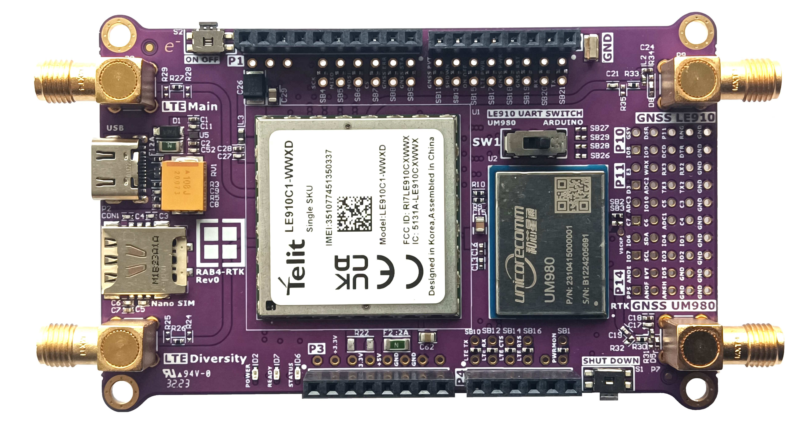

# RAB4-RTK Hardware Design Files

The RAB4-RTK is an evaluation board featuring the Telit LE910C1-WWXD LTE-Cat.1 and Unicore UM980 RTK GNSS. 

## Legal Disclaimer

The evaluation board including the software is for testing purposes only and, because it has limited functions and limited resilience, is not suitable for permanent use under real conditions. If the evaluation board is nevertheless used under real conditions, this is done at one’s responsibility; any liability of Rutronik is insofar excluded. 

